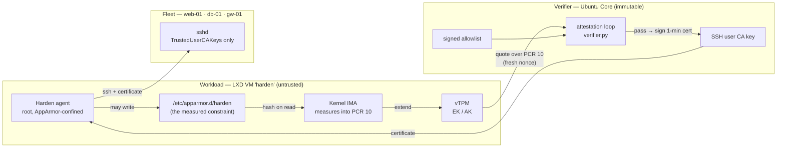
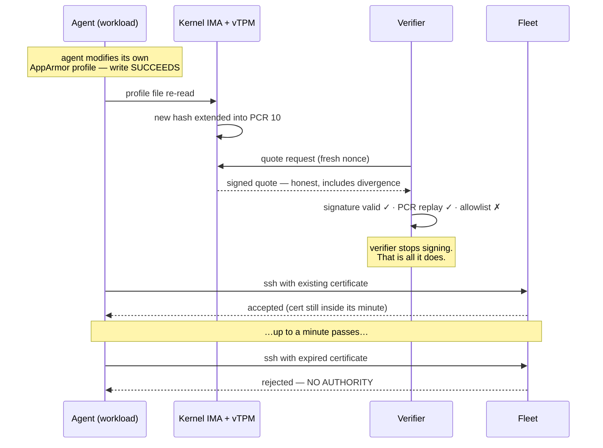

# Architecture

Three trust domains, one deliberate asymmetry: the domain where the agent is
powerful is the domain nothing trusts.

## The domains

**Workload** (LXD VM `harden`, secure boot, vTPM). The agent runs here *with
root*. Nothing in this domain is trusted — not the agent, not its config, not
even the kernel's good intentions. What the domain provides is honesty at the
hardware boundary: IMA measures every executable, every executable mapping,
and every file root reads into PCR 10 of the TPM, and the TPM will sign an
accurate report of those measurements whether the agent likes it or not. The
agent cannot un-extend a PCR.

**Verifier** (Ubuntu Core box in the full design; the host stands in for it
in this demo — see "Substrates" below). Holds three things: the AK public key
exported once at enrolment, the GPG-signed allowlist of expected
measurements, and the SSH CA private key. Every cycle it demands a fresh
quote over PCR 10 with a random nonce, checks the signature against the AK,
replays the measurement log against the quoted PCR value, and compares every
file hash to the allowlist. Pass → it signs a certificate valid for five
minutes. Fail → it does nothing. Refusing to act is the entire enforcement
mechanism.

**Fleet** (three LXD containers). Configured once with
`TrustedUserCAKeys /etc/ssh/attested_ca.pub`, passwords off. The fleet has
never heard of IMA, TPMs, or attestation. It asks exactly one question: *is
this certificate signed by the CA and still valid?* All the attestation
complexity is invisible from here, which is what makes the pattern deployable
— fleet hosts need zero new software.

## The revocation chain

The window between tamper and rejection is real, bounded by certificate TTL
plus one attestation interval, and measured honestly in
[EXPOSURE.md](EXPOSURE.md).

Restoring the modified file does not restore trust. PCR extension is
cumulative and the IMA log is append-only: the tampered profile's hash is in
the measured *history*, and no later write can remove it. The only road back
is a return to a wholly measured state — in this demo, restoring the
`demo-ready` snapshot (`make reset`), which reboots the VM and replays a
clean measurement log. The demo's final act (`90-demo.sh`, ACT 8) exercises
exactly this: repentance fails, rebuild succeeds.

Note what the verifier sees during a failure: *quote signature valid, PCR
replay matching*. The agent is not lying about its state — it cannot lie,
because the kernel and TPM report over its head. It is honestly reporting
that it modified itself. Authority dies precisely because the reporting
channel stays truthful while the state goes wrong.

## Why each component is load-bearing

| Component | Why it, specifically |
|---|---|
| LXD VM | containers share the host kernel and cannot do measured boot or own a TPM; a VM can |
| AppArmor | the constraint under measurement — a policy file the kernel enforces against the agent |
| Linux IMA | upstream kernel feature; turns "which files executed" into TPM-backed evidence |
| tpm2-tools | upstream TCG reference tooling for quote and verification |
| OpenSSH certificates | expiry-based authority in base Ubuntu; no new daemon on any fleet host |
| Ubuntu Core | immutability is why the verifier may hold the CA key |
| Chisel / Rockcraft | a minimal image keeps the allowlist small enough to be signal (see EXPOSURE.md) |
| llama.cpp | local model runtime for the agent's planning step |

The verifier is scratch-built (~500 lines total) rather than an adopted
attestation product. That is deliberate: it removes the vendor question and
demonstrates the primitive itself — nonce, quote, replay, compare, sign.

## Substrates: demo vs production

In this demo the verifier runs on the host and the TPM is swtpm-backed
(LXD's vTPM). **swtpm is not a root of trust** — the host can forge it.
Measured boot, IMA, quotes, and the revocation chain are all real; the
substrate under them is soft. Production swaps in a discrete TPM or a
confidential VM, and moves the verifier to a physically separate Ubuntu Core
device. That is a substrate change, not a design change: not one line of the
verifier logic changes. See [LIMITS.md](LIMITS.md) for the full honesty
budget.
